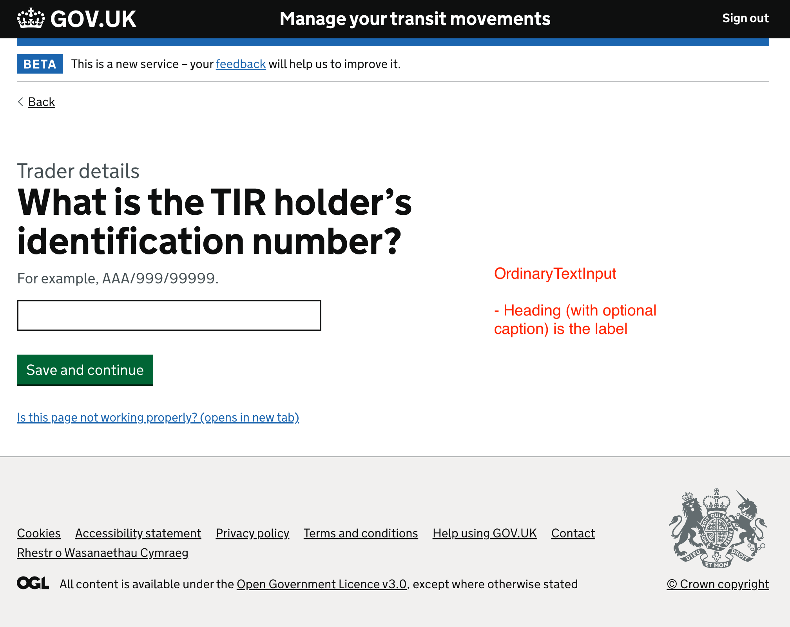
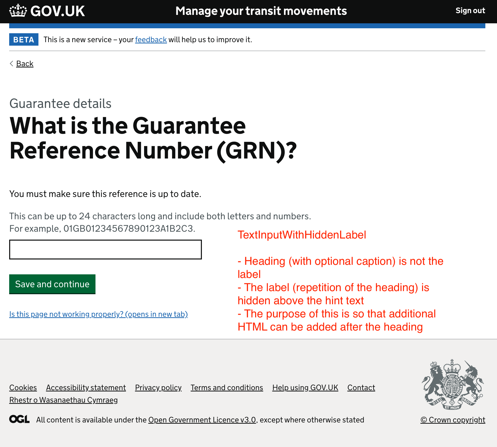
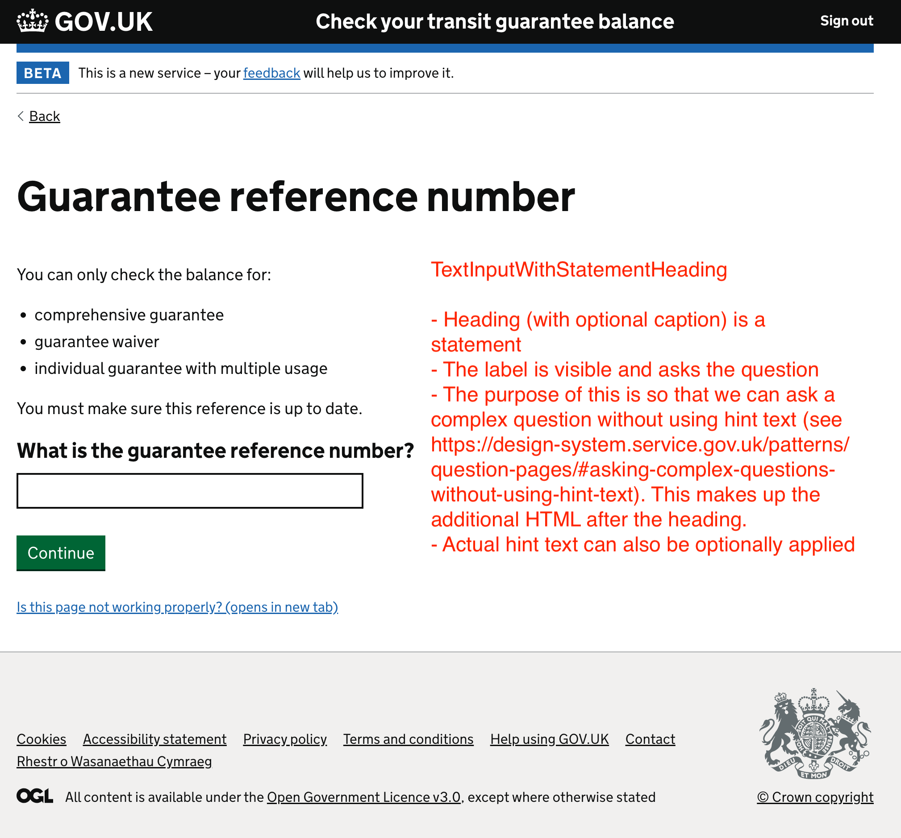
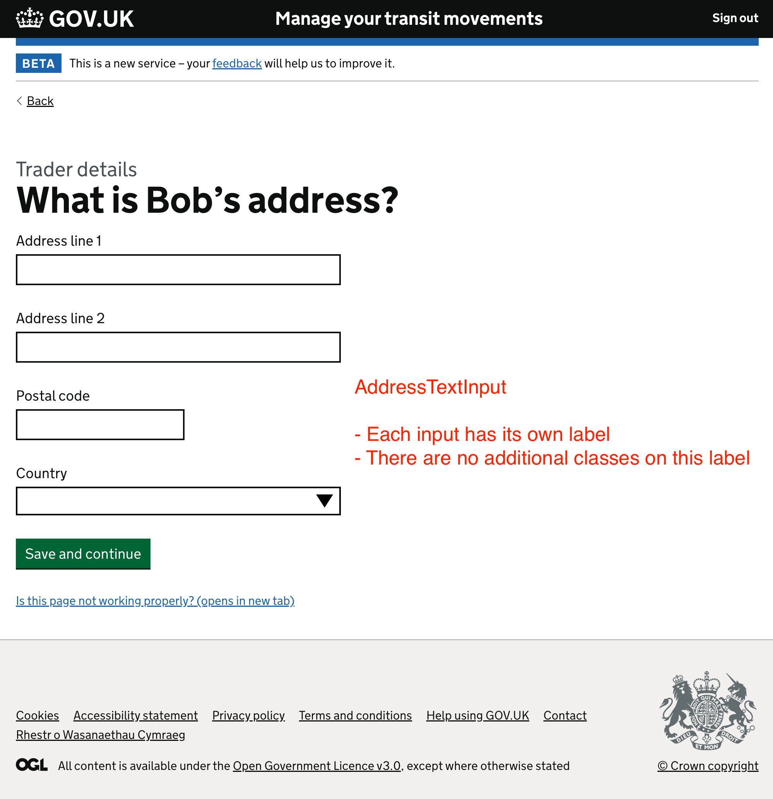

# manage-transit-movements-departure-frontend

This service allows a user to create a transit movement departure (IE015).
It contains the pre task list questions which act as dependencies for the other sections within the task list.
From this service, a user can also submit an amendment (IE013) to their departure declaration.

This service also acts as a proxy for the journey tests to post data to manage-transit-movements-departure-cache via a test-only POST endpoint.

Service manager port: 10120

### Testing

Run unit tests:
<pre>sbt test</pre>  
Run integration tests:
<pre>sbt it/test</pre>
Run accessibility linter tests:
<pre>sbt A11y/test</pre>

### Running manually or for journey tests

<pre>
sm2 --start CTC_TRADERS_P5_ACCEPTANCE
sm2 --stop MANAGE_TRANSIT_MOVEMENTS_DEPARTURE_FRONTEND
sbt run
</pre>

### Feature toggles

The following features can be toggled in [application.conf](conf/application.conf):

| Key                          | Argument type | sbt                                                             | Description                                                                                                                                                                                    |
|------------------------------|---------------|-----------------------------------------------------------------|------------------------------------------------------------------------------------------------------------------------------------------------------------------------------------------------|
| `trader-test.enabled`        | `Boolean`     | `sbt -Dtrader-test.enabled=true run`                            | If enabled, this will override the behaviour of the "Is this page not working properly?" and "feedback" links. This is so we can receive feedback in the absence of Deskpro in `externaltest`. |
| `countriesOfDeparture`       | `Seq[String]` | `sbt -DcountriesOfDeparture.0=GB countriesOfDeparture.1=XI run` | Controls which countries we fetch offices of departure for. This is so we can run XI only from June 28th before going live with both GB and XI on July 1st.                                    |
| `banners.showUserResearch`   | `Boolean`     | `sbt -Dbanners.showUserResearch=true run`                       | Controls whether or not we show the user research banner.                                                                                                                                      |
| `features.isPreLodgeEnabled` | `Boolean`     | `sbt -Dfeatures.isPreLodgeEnabled=true run`                     | Controls whether or not we ask the user if it is a standard (A) or pre-lodged (D) declaration. If false we default to standard (A).                                                            |
| `play.http.router`           | `String`      | `sbt -Dplay.http.router=testOnlyDoNotUseInAppConf.Routes run`   | Controls which router is used for the application, either `prod.Routes` or `testOnlyDoNotUseInAppConf.Routes`                                                                                  |

### Running Scaffold

Create New Page in sbt:
<pre>sbt --supershell=false
g8Scaffold radioButtonPage
</pre>
At this point you need to answer the questions to fill in the className, package, etc
This will create the pages and tests for a RadioButtonPage. It won't overwrite any classes that already exist

Return to command line:
<pre>./migrate.sh
</pre>

This updates the test classes app.routes and messages files

If you deviate from any of the default answers when creating a page via scaffold, your new code and tests may require additional intervention to get achieve passing tests

### Creating an Address Page in Scaffold
You can create an address page which will anticipate referencing a Name Page and a Country Page (both of which must be answered ahead of the address page)
<pre>g8Scaffold addressPage
-> package: foo.bar                       # use same package as created for Address name page above
-> title[My New Address]: Consignee Address                    
-> className[MyNewAddress]: ConsigneeAddress
-> formProvider [DynamicAddressFormProvider]
-> navRoute [PreTaskListDetails]:         # use same package as created for Address name page above
-> pageSection [PreTaskListSection]:      # use same package as created for Address name page above
</pre>

### Creating an InputSelect Page in Scaffold
This requires that you already have a Service class with a method that will return a list of the reference object that you require
That object must also extend Selectable.

For the test an arbitrary constructor of the Selectable object will be required, or you can manually create these objects
<pre>g8Scaffold inputSelectPage
-> package: foo.bar
-> className: OfficeOfDeparture
-> referenceClass = CustomsOffice
...
</pre>

### Component view models
In certain cases, we want to limit the number of ways in which the govuk design components are being used so that we can ensure the pages being built are accessible.
This has been done through the use of our own component view models, to define how a heading, caption, and label will be rendered relative to an input.

In the example of a text input, we have 4 distinct use cases:

 | 
:-------------------------:|:-------------------------:
 | 

There is similar logic behind the `InputYesNo` and `InputSelect` component view models.

### User answers reader
The navigation in this microservice is primarily driven by the `UserAnswersReader`.
This is so navigation and task list statuses can be driven by the same logic.
For any given `JourneyDomainModel`, a user answers reader is defined as the steps taken in order to have a valid set of user answers for that particular journey, often dependent on a series of other answers from previous sections.
Depending on the state of the user answers, the reader will either return a `Right` when the answers are in a completed state, or a `Left` when they are not.
The `Right` contains an instance of the journey domain model, which has a corresponding `routeIfCompleted` (generally a check your answers page) to navigate to.
The `Left` contains an instance of the page that caused the reader to fail, which has a corresponding `route` to navigate to.
Both have a list of the pages read by the user answers reader. Knowing this and the current page we can then accurately determine where to take the user to.

This logic is utilised by the navigators, add-to-list change links, and task list links.

NormalMode and CheckMode are still used. Generally speaking:
* sub-section check your answers pages use NormalMode
* section check your answers pages use CheckMode

### Tampermonkey Scripts
Tampermonkey scripts have been developed for automating the answering of questions within the departure frontends. The scripts can be found [here](tamperMonkey).

In order to run the scripts, you must have the Tampermonkey extension installed, which can be found on the Google Web Store, or the Firefox Addon browser.

They include:
  * Scripts for authorising
  * Scripts for answering the pre-task-list
  * Scripts for answering each individual section within a departure declaration

On the task list screen of the departure frontend you will see this menu if the scripts are running:

To use the scripts, simply press the journey you want answered, and the scripts will go through and answer each question for you.

Keep in mind sometimes if a page has been updated and the scripts have not, you will have to manually intervene and answer a question and then the scripts will run again as usual, or, if the scripts get stuck, and you want to stop them, you can press the "Stop Scripts" button.

If a new update for the scripts has been released, you must visit the relevant file on GitHub and press "Raw" and the Tampermonkey extension will give you the option to update.

### License

This code is open source software licensed under the [Apache 2.0 License]("http://www.apache.org/licenses/LICENSE-2.0.html").

